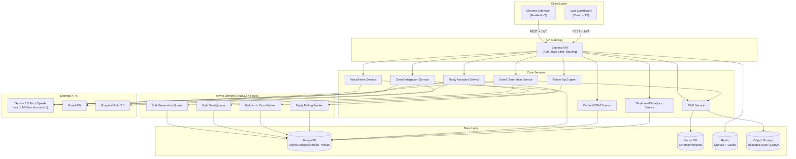
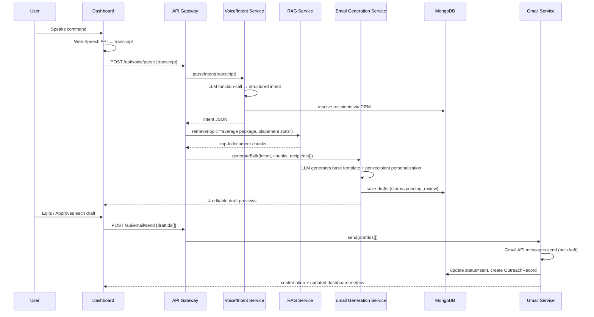
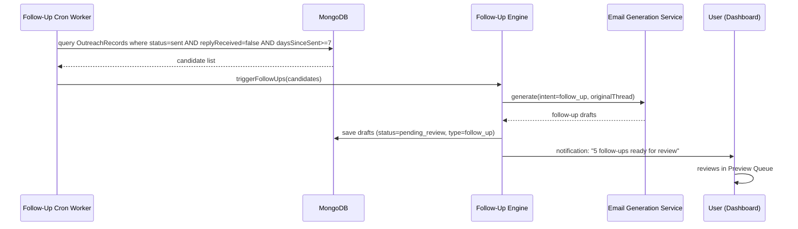
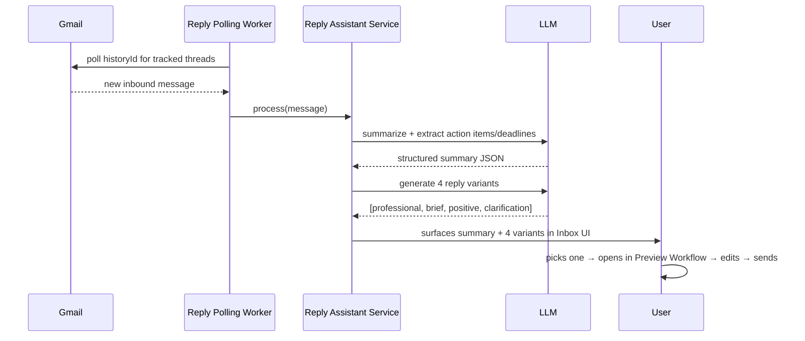
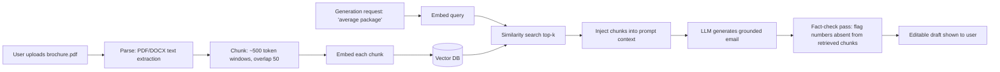

# AI Outreach Agent — System Architecture

## 1. High-Level Architecture



**Key principle:** the API Gateway never calls the LLM or Gmail directly — it routes to dedicated services, each with a single responsibility. This keeps the "GenAI surface area" isolated and swappable (see `LLMClient` abstraction below) and keeps Gmail send-logic auditable in one place.

---

## 2. Low-Level Architecture — Service Responsibilities

| Service | Responsibility | Talks To |
|---|---|---|
| **Voice/Intent Service** | Receives transcript, calls LLM with function-calling schema, returns structured intent | LLM, CRM (to resolve names → contacts) |
| **Email Generation Service** | Given intent + retrieved facts, produces subject/body/signature; handles single and bulk (templated) generation | LLM, RAG Service, Bulk Generation Queue |
| **RAG Service** | Document ingestion (parse → chunk → embed → store), and retrieval (query → top-k chunks) | Vector DB, Object Storage, Embedding model |
| **Gmail Integration Service** | OAuth token lifecycle, drafts.create, messages.send, threads.get/list, history polling | Gmail API, Google OAuth, Bulk Send Queue |
| **Contact/CRM Service** | CRUD on HR contacts, search/filter, communication history rollups | MongoDB |
| **Follow-Up Engine** | Daily cron scans OutreachRecords for stale, unreplied sends; triggers Email Generation Service with `intent=follow_up` | MongoDB, Email Generation Service, Cron Worker |
| **Reply Assistant Service** | Polls/watches for inbound mail on tracked threads, summarizes, extracts action items/deadlines, generates 4 reply variants | Gmail API, LLM |
| **Dashboard/Analytics Service** | Aggregation queries for metrics & chart data | MongoDB (aggregation pipeline) |

### The `LLMClient` Abstraction

```ts
interface LLMClient {
  generate(params: {
    systemPrompt: string;
    messages: ChatMessage[];
    responseSchema?: JSONSchema; // forces structured output
    temperature?: number;
  }): Promise<LLMResponse>;

  embed(text: string): Promise<number[]>;
}

// Concrete implementations
class GeminiClient implements LLMClient { /* primary */ }
class OpenAIClient implements LLMClient { /* fallback / A-B */ }

// Selected via env/config, with automatic failover:
const llm = new ResilientLLMClient([new GeminiClient(), new OpenAIClient()]);
```

Every GenAI-touching service depends on the `LLMClient` interface, never a concrete SDK. This is what makes "Gemini primary, OpenAI optional" a config change, not a rewrite — and it's a strong talking point for the "how would you avoid vendor lock-in" interview question.

---

## 3. Folder Structure (Monorepo)

```
ai-outreach-agent/
├── apps/
│   ├── dashboard/                 # React + TS + Tailwind web app
│   │   ├── src/
│   │   │   ├── pages/
│   │   │   │   ├── Dashboard.tsx
│   │   │   │   ├── ComposeVoice.tsx
│   │   │   │   ├── BulkUpload.tsx
│   │   │   │   ├── PreviewQueue.tsx
│   │   │   │   ├── Contacts.tsx
│   │   │   │   ├── Inbox.tsx           # Reply Assistant UI
│   │   │   │   └── Settings.tsx
│   │   │   ├── components/
│   │   │   │   ├── voice/MicButton.tsx
│   │   │   │   ├── voice/TranscriptPanel.tsx
│   │   │   │   ├── email/EmailPreviewCard.tsx
│   │   │   │   ├── email/RegenerateModal.tsx
│   │   │   │   ├── crm/ContactTable.tsx
│   │   │   │   ├── charts/ResponseRateChart.tsx
│   │   │   │   └── charts/OutreachTrendChart.tsx
│   │   │   ├── hooks/
│   │   │   │   ├── useSpeechToText.ts
│   │   │   │   ├── useEmailDraft.ts
│   │   │   │   └── useGmailAuth.ts
│   │   │   ├── api/                    # typed API client (shared types)
│   │   │   └── store/                  # Zustand/Redux state
│   │   └── package.json
│   │
│   └── extension/                  # Manifest V3 Chrome Extension
│       ├── manifest.json
│       ├── src/
│       │   ├── background/service-worker.ts
│       │   ├── content-scripts/gmail-compose-injector.ts
│       │   ├── content-scripts/gmail-toolbar.tsx
│       │   ├── popup/Popup.tsx
│       │   └── shared/messaging.ts    # chrome.runtime message contracts
│       └── package.json
│
├── services/
│   ├── api/                        # Express API Gateway + Core Services
│   │   ├── src/
│   │   │   ├── routes/
│   │   │   │   ├── voice.routes.ts
│   │   │   │   ├── email.routes.ts
│   │   │   │   ├── rag.routes.ts
│   │   │   │   ├── gmail.routes.ts
│   │   │   │   ├── contacts.routes.ts
│   │   │   │   ├── followup.routes.ts
│   │   │   │   ├── reply.routes.ts
│   │   │   │   └── dashboard.routes.ts
│   │   │   ├── services/
│   │   │   │   ├── voice.service.ts
│   │   │   │   ├── emailGeneration.service.ts
│   │   │   │   ├── rag.service.ts
│   │   │   │   ├── gmail.service.ts
│   │   │   │   ├── crm.service.ts
│   │   │   │   ├── followup.service.ts
│   │   │   │   └── reply.service.ts
│   │   │   ├── llm/
│   │   │   │   ├── LLMClient.ts
│   │   │   │   ├── GeminiClient.ts
│   │   │   │   ├── OpenAIClient.ts
│   │   │   │   └── prompts/             # prompt template files (see Prompts Library)
│   │   │   ├── models/                  # Mongoose schemas
│   │   │   ├── middleware/
│   │   │   │   ├── auth.middleware.ts
│   │   │   │   ├── rateLimit.middleware.ts
│   │   │   │   └── promptInjectionGuard.middleware.ts
│   │   │   └── index.ts
│   │   └── package.json
│   │
│   └── worker/                     # BullMQ workers (separate process/deploy)
│       ├── src/
│       │   ├── queues/
│       │   │   ├── bulkGeneration.queue.ts
│       │   │   ├── bulkSend.queue.ts
│       │   │   ├── followUpCron.queue.ts
│       │   │   └── replyPolling.queue.ts
│       │   └── index.ts
│       └── package.json
│
├── packages/
│   └── shared/                     # shared TS types, Zod schemas, constants
│       ├── src/types/
│       └── package.json
│
├── infra/
│   ├── docker-compose.yml
│   ├── Dockerfile.api
│   ├── Dockerfile.worker
│   └── vercel.json
│
└── docs/                           # this spec
```

---

## 4. Sequence Diagram — Voice-to-Bulk-Email (Primary Use Case)



## 5. Sequence Diagram — Follow-Up Agent



## 6. Sequence Diagram — AI Reply Assistant



## 7. Data Flow Diagram — Document-Aware Generation (RAG)



---

*Continue to `03-DATABASE-AND-API.md` for the full schema and endpoint specification.*
