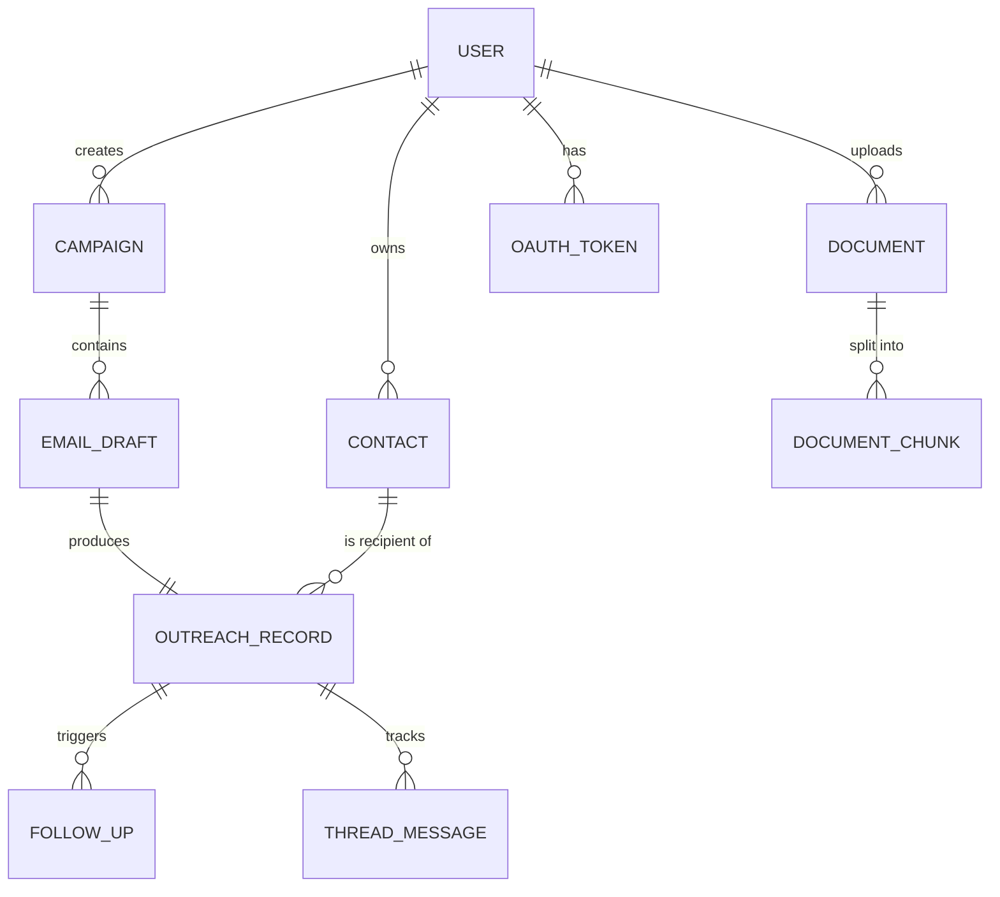

# AI Outreach Agent — Database Schema & API Specification

## 1. Entity Relationship Overview



## 2. Collections (MongoDB / Mongoose)

### `users`
```ts
{
  _id: ObjectId,
  googleId: string,          // sub claim from Google OAuth
  email: string,
  name: string,
  avatarUrl: string,
  role: "admin" | "member",          // RBAC
  orgId: ObjectId,                   // multi-tenant grouping (e.g. placement cell)
  signature: string,                 // used in email generation
  dailySendCap: number,              // default 500, configurable
  createdAt: Date,
  updatedAt: Date
}
// Index: { email: 1 } unique, { orgId: 1 }
```

### `oauth_tokens`
```ts
{
  _id: ObjectId,
  userId: ObjectId,
  provider: "google",
  accessTokenEnc: string,    // AES-256-GCM encrypted, KMS-managed key
  refreshTokenEnc: string,
  scope: string[],           // gmail.send, gmail.compose, gmail.readonly
  expiresAt: Date,
  createdAt: Date
}
// Index: { userId: 1 } unique
```

### `contacts` (Mini CRM)
```ts
{
  _id: ObjectId,
  orgId: ObjectId,
  company: string,
  hrName: string,
  designation: string,
  email: string,
  phone: string,
  status: "new" | "contacted" | "replied" | "closed",
  lastContactDate: Date,
  notes: string,
  tags: string[],
  createdAt: Date,
  updatedAt: Date
}
// Index: { orgId: 1, company: 1 }, { orgId: 1, email: 1 } unique, text index on { company, hrName, notes }
```

### `documents` (RAG sources)
```ts
{
  _id: ObjectId,
  orgId: ObjectId,
  uploadedBy: ObjectId,
  fileName: string,
  fileType: "pdf" | "docx" | "xlsx" | "csv",
  storageUrl: string,          // S3/R2 object URL
  docType: "brochure" | "statistics" | "company_info" | "template" | "other",
  status: "processing" | "indexed" | "failed",
  chunkCount: number,
  createdAt: Date
}
// Index: { orgId: 1, docType: 1 }
```

### `document_chunks` (mirrors vectors, metadata lives here; embeddings live in vector DB keyed by `_id`)
```ts
{
  _id: ObjectId,
  documentId: ObjectId,
  orgId: ObjectId,
  chunkIndex: number,
  text: string,
  vectorId: string,          // pointer into Chroma/Pinecone
  metadata: { page: number, section: string },
  createdAt: Date
}
// Index: { documentId: 1 }, { orgId: 1 }
```

### `campaigns`
```ts
{
  _id: ObjectId,
  orgId: ObjectId,
  createdBy: ObjectId,
  name: string,                  // e.g. "2027 Placement Invitations"
  sourceIntent: object,          // raw parsed intent JSON from voice/text command
  status: "draft" | "in_review" | "sent" | "partially_sent",
  recipientCount: number,
  createdAt: Date
}
// Index: { orgId: 1, createdAt: -1 }
```

### `email_drafts`
```ts
{
  _id: ObjectId,
  campaignId: ObjectId,
  contactId: ObjectId,
  orgId: ObjectId,
  type: "outreach" | "follow_up" | "reply",
  subject: string,
  body: string,                  // HTML or markdown
  signature: string,
  status: "pending_review" | "approved" | "sending" | "sent" | "failed" | "rejected",
  generationMeta: {
    model: string,
    promptVersion: string,
    retrievedChunkIds: [ObjectId],
    regenerateCount: number
  },
  editHistory: [{ editedAt: Date, prevBody: string }],
  createdAt: Date,
  updatedAt: Date
}
// Index: { campaignId: 1 }, { orgId: 1, status: 1 }
```

### `outreach_records`
```ts
{
  _id: ObjectId,
  orgId: ObjectId,
  draftId: ObjectId,
  contactId: ObjectId,
  company: string,
  gmailThreadId: string,
  gmailMessageId: string,
  sentAt: Date,
  replyReceived: boolean,
  replyReceivedAt: Date,
  status: "sent" | "delivered" | "bounced" | "replied",
  followUpCount: number,
  lastFollowUpAt: Date
}
// Index: { orgId: 1, replyReceived: 1, sentAt: 1 }  -- powers the Follow-Up Agent query
// Index: { gmailThreadId: 1 }
```

### `follow_ups`
```ts
{
  _id: ObjectId,
  outreachRecordId: ObjectId,
  draftId: ObjectId,
  sequenceNumber: number,        // 1st follow-up, 2nd, etc.
  triggeredAt: Date,
  status: "pending_review" | "sent"
}
```

### `thread_messages` (inbound + outbound, for the Reply Assistant + thread view)
```ts
{
  _id: ObjectId,
  outreachRecordId: ObjectId,
  gmailMessageId: string,
  direction: "outbound" | "inbound",
  from: string,
  snippet: string,
  fullBodyRef: string,           // pointer to blob storage if large
  aiSummary: string,
  actionItems: [string],
  deadlines: [{ label: string, date: Date }],
  receivedAt: Date
}
// Index: { outreachRecordId: 1, receivedAt: 1 }
```

---

## 3. REST API Specification

Base URL: `/api/v1`. All routes except `/auth/*` require `Authorization: Bearer <JWT>`.

### Auth
| Method | Path | Description |
|---|---|---|
| GET | `/auth/google` | Redirects to Google OAuth consent screen |
| GET | `/auth/google/callback` | Handles OAuth callback, issues JWT session, stores encrypted tokens |
| POST | `/auth/logout` | Invalidates session |
| GET | `/auth/me` | Returns current user profile |

### Voice / Intent
| Method | Path | Description |
|---|---|---|
| POST | `/voice/parse` | Body: `{ transcript: string }` → Returns structured intent JSON |

```json
// Response example
{
  "intent": "bulk_outreach",
  "topic": "placement invitation",
  "year": "2027",
  "recipients": ["Microsoft", "Amazon", "Adobe", "Atlassian"],
  "requiredFacts": ["average package", "placement brochure"],
  "tone": "professional",
  "confidence": 0.94
}
```

### Email Generation
| Method | Path | Description |
|---|---|---|
| POST | `/email/generate` | Single email from intent → returns 1 draft |
| POST | `/email/generate-bulk` | Body: `{ intent, recipientIds: [] }` → async, returns `campaignId`; drafts pushed via webhook/poll |
| POST | `/email/:draftId/regenerate` | Body: `{ instruction?: string }` → re-generates with feedback |
| PATCH | `/email/:draftId` | Manual edit save |
| POST | `/email/:draftId/approve` | Marks `approved` |
| POST | `/email/send` | Body: `{ draftIds: [] }` → triggers Gmail send |
| GET | `/email/campaign/:campaignId` | List all drafts in a campaign (Preview Queue view) |

### RAG / Documents
| Method | Path | Description |
|---|---|---|
| POST | `/documents/upload` | Multipart upload, `docType` field; triggers async ingestion |
| GET | `/documents` | List documents + status |
| DELETE | `/documents/:id` | Removes doc + its chunks/vectors |
| POST | `/rag/query` | Internal/debug: `{ query: string, topK: number }` → raw retrieved chunks |

### Gmail
| Method | Path | Description |
|---|---|---|
| GET | `/gmail/threads/:threadId` | Fetch thread messages |
| POST | `/gmail/draft` | Create a Gmail draft (not sent) |
| GET | `/gmail/quota` | Returns today's send count vs `dailySendCap` |

### Contacts (CRM)
| Method | Path | Description |
|---|---|---|
| GET | `/contacts` | Query params: `search, company, status, page, limit` |
| POST | `/contacts` | Create contact |
| POST | `/contacts/bulk-import` | CSV/XLSX upload → parses + upserts |
| PATCH | `/contacts/:id` | Update |
| DELETE | `/contacts/:id` | Delete |
| GET | `/contacts/:id/history` | Communication history (outreach + follow-ups + replies) |

### Follow-Up Agent
| Method | Path | Description |
|---|---|---|
| GET | `/followups/pending` | Candidates per current rules (e.g. 7-day no-reply) |
| POST | `/followups/generate` | Body: `{ outreachRecordIds: [], instruction?: string }` |
| GET | `/followups/settings` | Org-level follow-up cadence config |
| PATCH | `/followups/settings` | Update cadence (e.g. 7 / 14 / 21 day sequence) |

### Reply Assistant
| Method | Path | Description |
|---|---|---|
| GET | `/replies/inbox` | List inbound messages with AI summaries |
| GET | `/replies/:threadMessageId` | Full detail incl. action items/deadlines |
| POST | `/replies/:threadMessageId/suggest` | Body: `{ variant: "professional"\|"brief"\|"positive"\|"clarification" }` |

### Dashboard
| Method | Path | Description |
|---|---|---|
| GET | `/dashboard/summary` | Emails Sent, Replies, Response Rate, Pending, Follow-Ups Due |
| GET | `/dashboard/charts/daily` | Daily email volume series |
| GET | `/dashboard/charts/response-trends` | Per-company response trend series |

### Extension-specific (used by the Chrome Extension's content script via background worker)
| Method | Path | Description |
|---|---|---|
| POST | `/extension/compose/generate` | Body: `{ context: "new"\|"reply", threadText?: string, instruction: string }` |
| POST | `/extension/compose/rewrite` | Body: `{ selectedText: string, mode: "professional"\|"concise"\|"expand" }` |
| POST | `/extension/thread/summarize` | Body: `{ threadText: string }` |

---

## 4. Standard Response Envelope

```json
{
  "success": true,
  "data": { },
  "error": null,
  "meta": { "requestId": "uuid", "timestamp": "ISO8601" }
}
```

Errors follow:
```json
{
  "success": false,
  "data": null,
  "error": { "code": "RATE_LIMIT_EXCEEDED", "message": "Daily send cap reached (500/500)." }
}
```

---

*Continue to `04-EXTENSION-RAG-GMAIL.md` for the Chrome Extension internals, RAG pipeline detail, and Gmail OAuth/send architecture.*
