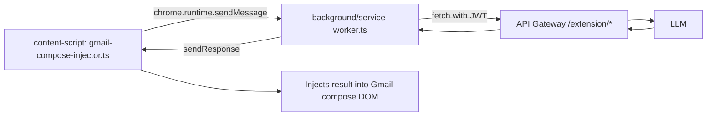
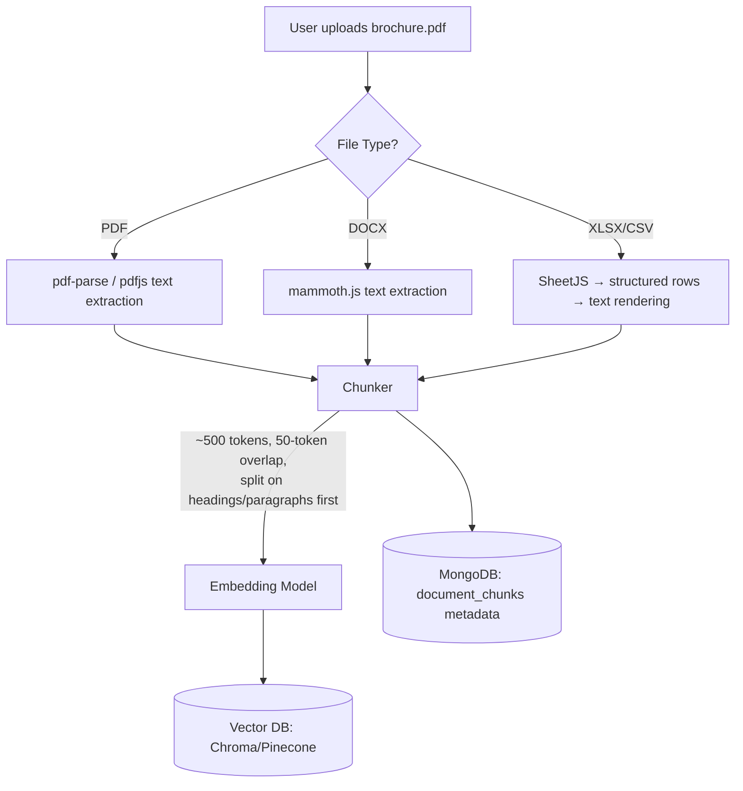
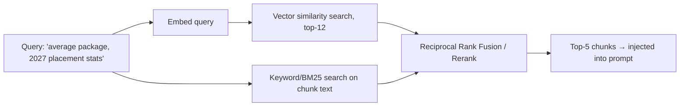
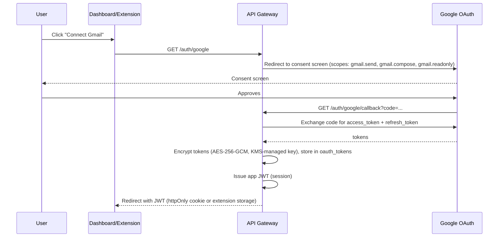

# AI Outreach Agent — Chrome Extension, RAG, and Gmail Integration Architecture

## Part A — Chrome Extension (Manifest V3)

### A.1 manifest.json

```json
{
  "manifest_version": 3,
  "name": "AI Outreach Agent",
  "version": "1.0.0",
  "permissions": ["storage", "activeTab", "scripting", "identity"],
  "host_permissions": ["https://mail.google.com/*"],
  "background": {
    "service_worker": "background/service-worker.js",
    "type": "module"
  },
  "content_scripts": [
    {
      "matches": ["https://mail.google.com/*"],
      "js": ["content-scripts/gmail-compose-injector.js"],
      "run_at": "document_idle"
    }
  ],
  "action": {
    "default_popup": "popup/index.html"
  },
  "oauth2": {
    "client_id": "<GOOGLE_OAUTH_CLIENT_ID>",
    "scopes": ["https://www.googleapis.com/auth/gmail.send", "https://www.googleapis.com/auth/gmail.compose"]
  }
}
```

### A.2 Why a Content Script + Service Worker Split

Gmail is a heavily-obfuscated single-page app with no public DOM API. The extension cannot assume stable class names, so it uses **resilient selector strategies**:

- Target `[role="textbox"][aria-label*="Message Body"]` (ARIA roles are far more stable across Gmail's frequent UI refactors than CSS classes).
- A `MutationObserver` on the compose container re-attaches the floating AI toolbar whenever Gmail tears down and rebuilds the compose DOM node (which it does often, e.g. on minimize/maximize).
- All actual LLM calls happen in the **background service worker**, never in the content script — content scripts run in an isolated world with no direct network access guarantees and are the least trusted execution context (a compromised Gmail page should not be able to exfiltrate API keys).



### A.3 Message Passing Contract

```ts
// shared/messaging.ts
type ExtensionMessage =
  | { type: "GENERATE_EMAIL"; payload: { context: "new" | "reply"; threadText?: string; instruction: string } }
  | { type: "REWRITE_SELECTION"; payload: { selectedText: string; mode: "professional" | "concise" | "expand" } }
  | { type: "SUMMARIZE_THREAD"; payload: { threadText: string } };

type ExtensionResponse =
  | { ok: true; result: string }
  | { ok: false; error: string };
```

The content script never holds the user's JWT — it sends a message to the background worker, which holds the authenticated session (via `chrome.storage.local`, encrypted at rest using the Web Crypto API) and performs the authenticated fetch.

### A.4 Floating Toolbar UX

Injected as a small React root mounted into a `div` appended near the compose toolbar:

```
[ ✨ Generate ]  [ Rewrite ▾ ]  [ Summarize Thread ]
                    ├─ Make Professional
                    ├─ Make Concise
                    └─ Expand
```

Selecting text in the compose box and clicking **Rewrite → Make Concise** sends the selection to `/extension/compose/rewrite`, then replaces the selection range via `Selection`/`Range` DOM APIs (not `innerHTML` overwrite, to preserve Gmail's internal event listeners and undo stack).

---

## Part B — RAG Architecture (Document-Aware Generation)

### B.1 Ingestion Pipeline



**Chunking strategy specifics:**
- Primary split on structural boundaries (headings, table rows, bullet lists) before falling back to fixed-size token windows — this keeps a "placement statistics" table intact in one chunk rather than splitting mid-row.
- Each chunk stores metadata: `{ documentId, docType, page, section }` so retrieval can be filtered (e.g., "only search `docType=brochure`") in addition to pure similarity.
- Tables (e.g., average package by branch) are rendered to a normalized text format (`"Branch: CSE | Average Package: ₹12.4 LPA"`) before embedding — raw table extraction is preserved separately for exact-number lookups.

### B.2 Retrieval Strategy



A **hybrid search** (semantic + keyword) is used rather than pure vector similarity, because numeric facts ("12.4 LPA", "87% placement rate") are exactly the kind of token that embedding models can blur together with similar-but-wrong numbers. BM25 keyword matching catches exact figures that semantic search alone might rank lower.

### B.3 Grounded Generation & Fact-Checking

The retrieved chunks are injected into the system prompt with explicit instructions to **only state facts present in the provided context**, and the generation service runs a lightweight post-generation check: every number/date in the generated email is regex-extracted and verified to appear somewhere in the retrieved chunks. Mismatches are flagged in the UI (e.g., a yellow underline) rather than silently sent — this is surfaced to the human reviewer in the Preview Workflow, never auto-corrected silently.

### B.4 Vector DB Choice

| Stage | Choice | Why |
|---|---|---|
| MVP / single-org | **ChromaDB** (self-hosted, embedded or as a sidecar service) | Free, simple, sufficient for thousands of chunks |
| Multi-tenant scale | **Pinecone** (managed, namespaced per `orgId`) | Handles millions of vectors, low-latency at scale, no infra ops burden |

Migration path: the RAG Service is written against a `VectorStore` interface (`upsert`, `query`, `delete`) identical in spirit to the `LLMClient` abstraction — swapping Chroma for Pinecone is a config + adapter change, not a rewrite.

---

## Part C — Gmail Integration Architecture

### C.1 OAuth 2.0 Flow



**Scopes requested — minimum necessary:**
- `gmail.send` — to send mail
- `gmail.compose` — to create drafts
- `gmail.readonly` (thread/message metadata only, scoped to tracked threads) — to detect replies

No `gmail.modify` or full-mailbox scope is requested; the app only ever reads messages within threads it itself created.

### C.2 Token Lifecycle

- Access tokens (short-lived, ~1hr) are refreshed transparently using the stored refresh token; refresh failures (e.g., user revoked access) surface a "Reconnect Gmail" banner rather than silently failing sends.
- Refresh tokens are encrypted at rest; the encryption key itself is never stored in the same database (managed via a KMS or environment-injected secret in the API process only).
- Token revocation: `/auth/disconnect` calls Google's token revocation endpoint and purges the `oauth_tokens` document.

### C.3 Sending

```ts
// gmail.service.ts (simplified)
async function sendEmail(userId: string, draft: EmailDraft) {
  const auth = await getAuthorizedClient(userId); // refreshes token if needed
  const raw = buildMimeMessage(draft); // base64url-encoded RFC 2822 message
  const res = await gmail.users.messages.send({
    auth, userId: "me",
    requestBody: { raw, threadId: draft.threadId } // threadId set for follow-ups/replies
  });
  await OutreachRecord.create({ ...{ gmailMessageId: res.data.id, gmailThreadId: res.data.threadId } });
}
```

Every send is **idempotent**: a `dedupeKey` (hash of `draftId + recipient`) prevents double-sends if a request is retried after a network blip — critical for bulk sends where a partial failure must not duplicate mail to recipients who already received it.

### C.4 Thread & Reply Tracking

A scheduled worker polls `users.history.list` (using the stored `historyId` watermark) for each connected user, filtered to threads present in `outreach_records`. New inbound messages matching a tracked `threadId` are written to `thread_messages` and pushed into the Reply Assistant pipeline. (Push-based Gmail `watch()` + Pub/Sub is the production upgrade path over polling — noted in the Roadmap doc as a V2 item.)

---

*Continue to `05-PROMPTS-LIBRARY.md` for the exact prompt templates powering every GenAI call in this system.*
